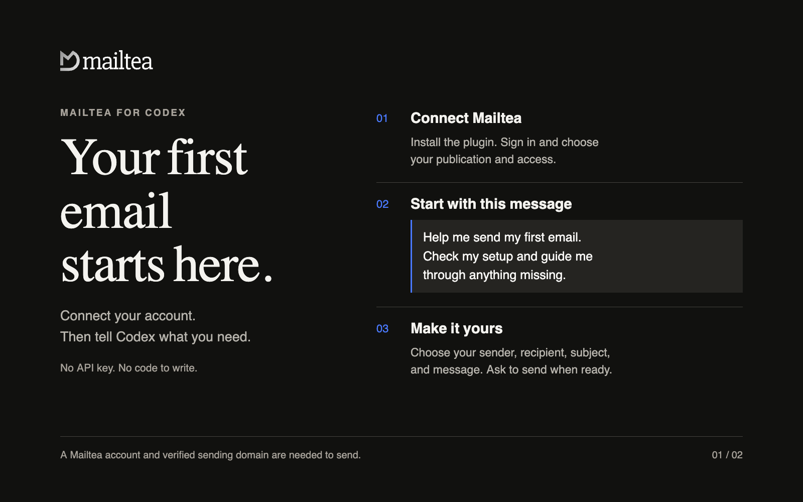
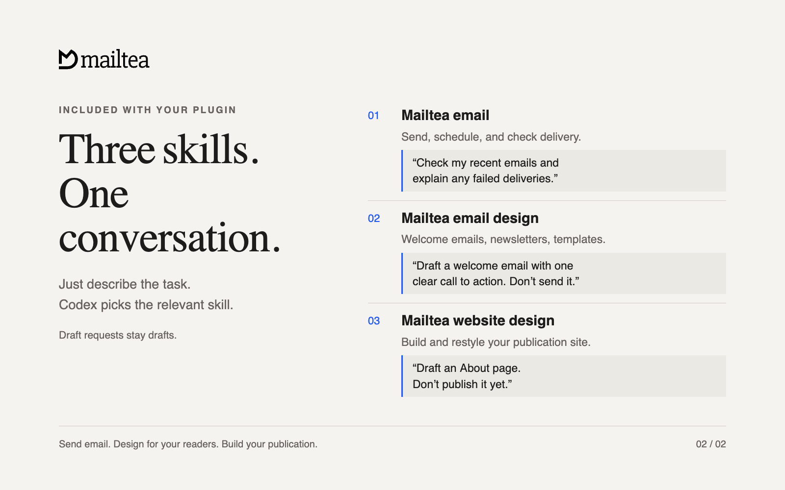

# Mailtea Agent Plugin

Send your first email. Design your next newsletter. Just ask.

One package that gives an AI coding agent the **Mailtea MCP server** and three
**skills** for email, email design, and publication websites. It targets
[Agent Plugins 1.0.0](https://agent-plugins.org/) and carries a native manifest
for every client that has its own format.



## Get started

You need a **Mailtea account**. Sending also needs a **verified sending
domain**. The hosted connection needs no API key, no Node.js install, and no
code — you sign in through your browser.

| Client | Install |
|---|---|
| **Any client** | `npx plugins add mailtea-app/mailtea-agent-plugin` |
| **Codex** | `codex plugin marketplace add mailtea-app/mailtea-agent-plugin` then `codex plugin add mailtea@mailtea` |
| **Claude Code** | `claude plugin marketplace add mailtea-app/mailtea-agent-plugin` then `claude plugin install mailtea@mailtea` |
| **Cursor** | Settings → Plugins → Add from repository, or `npx plugins add mailtea-app/mailtea-agent-plugin -t cursor` |
| **Grok Bot (in Cursor)** | Installs with the Cursor plugin above; no separate step |
| **VS Code / GitHub Copilot** | Command Palette → **MCP: Browse servers**, or `npx plugins add mailtea-app/mailtea-agent-plugin -t vscode` |
| **Kiro** | MCP settings → add server, or `npx plugins add mailtea-app/mailtea-agent-plugin -t kiro` |
| **Grok Build** | `/marketplace`, add `mailtea-app/mailtea-agent-plugin`, then install `mailtea` |
| **Gemini CLI** | `gemini extensions install https://github.com/mailtea-app/mailtea-agent-plugin` |
# Mailtea Agent Plugin

Send your first email. Design your next newsletter. Just ask.

One package that gives an AI coding agent the **Mailtea MCP server** and three
**skills** for email, email design, and publication websites. It targets
[Agent Plugins 1.0.0](https://agent-plugins.org/) and carries a native manifest
for every client that has its own format.


## Get started

You need a **Mailtea account**. Sending also needs a **verified sending
domain**. The hosted connection needs no API key, no Node.js install, and no
code — you sign in through your browser.

| Client | Install |
|---|---|
| **Any client** | `npx plugins add mailtea-app/mailtea-agent-plugin` |
| **Codex** | `codex plugin marketplace add mailtea-app/mailtea-agent-plugin` then `codex plugin add mailtea@mailtea` |
| **Claude Code** | `claude plugin marketplace add mailtea-app/mailtea-agent-plugin` then `claude plugin install mailtea@mailtea` |
| **Cursor** | Settings → Plugins → Add from repository, or `npx plugins add mailtea-app/mailtea-agent-plugin -t cursor` |
| **Grok Bot (in Cursor)** | Installs with the Cursor plugin above; no separate step |
| **VS Code / GitHub Copilot** | Command Palette → **MCP: Browse servers**, or `npx plugins add mailtea-app/mailtea-agent-plugin -t vscode` |
| **Kiro** | MCP settings → add server, or `npx plugins add mailtea-app/mailtea-agent-plugin -t kiro` |
| **Grok Build** | `/marketplace`, add `mailtea-app/mailtea-agent-plugin`, then install `mailtea` |
| **Gemini CLI** | `gemini extensions install https://github.com/mailtea-app/mailtea-agent-plugin` |
| **OpenCode** | Add the MCP server `https://api.mailtea.app/mcp` (type `remote`) in `opencode.json`, then run `opencode mcp auth mailtea` |
| **GitHub Copilot CLI** | `copilot mcp add mailtea https://api.mailtea.app/mcp`, then connect from an interactive session |
| **Windsurf** | Settings → Cascade → MCP servers → add `https://api.mailtea.app/mcp` |
| **Claude.ai** | Settings → Connectors → Add custom connector → `https://api.mailtea.app/mcp` |
| **ChatGPT** | Settings → Connectors → Add → `https://api.mailtea.app/mcp` (Developer mode) |

`npx plugins add` is the universal path. The
[`plugins` CLI](https://www.npmjs.com/package/plugins) reads this package's
`plugin.json` and installs it into whichever agent tools it detects — Claude
Code, Cursor, Codex, Grok Build, Kimi Code, GitHub Copilot CLI, and VS Code.
Use `-t <target>` to pick one, and `npx plugins targets` to see what it found.

Then open a new session, connect Mailtea through the browser sign-in prompt,
choose your publication and the access you want to grant, and paste:

> Help me send my first email with Mailtea. Check my setup and guide me through anything missing.

Your agent checks the publications, senders, and domain verification available
to your account, and explains the next step for anything missing. You do not
need to know tool names or pick a skill.

Need an account? [Start with Mailtea](https://mailtea.app).
Need a sending domain? [Domain setup](https://docs.mailtea.app/docs/documentation/domains).

## Three skills, ready when you need them

Your agent selects the relevant skill from your request. You can also name a
skill if you want to be explicit.

| Included skill | What it helps you do | Try saying |
| --- | --- | --- |
| **Mailtea email** (`mailtea-email`) | Send or schedule email, check delivery, draft newsletters, and manage contacts | “Help me send my first email.” |
| **Mailtea email design** (`mailtea-email-design`) | Design welcome emails, newsletters, and reusable templates for real inboxes | “Draft a welcome email with one clear call to action. Do not send it yet.” |
| **Mailtea website design** (`mailtea-site-design`) | Build or restyle your publication's website, with changes saved as drafts | “Draft an About page for my publication. Do not publish it yet.” |



## Copy a prompt

**Send one email** — replace the bracketed details with your own:

> Send an email from [my verified sender] to [recipient]. Subject: [subject]. Message: [body].

**Schedule a send:**

> Schedule this email for [date and time, including time zone]. Use [verified sender] and send only to [recipient].

**Check delivery:**

> Check my recent Mailtea emails and explain any failed deliveries.

**Create a newsletter draft:**

> Draft a newsletter for [publication] about [topic]. Give it a clear subject and one call to action. Do not send it yet.

**Design your website:**

> Draft a home page for [publication] using its brand and existing content. Do not publish it yet.

## What happens when you ask

- **Draft means draft.** Draft requests do not send email or publish a website.
- **You choose who receives an email.** Your agent asks for missing details and
  uses the sender, recipients, and content you supply or approve.
- **An email ID means accepted, not delivered.** Ask for delivery status to
  check the result. Do not repeat a send after a timeout until its status is
  known.
- **Your permissions apply.** The connection only reaches what your Mailtea
  account and the access you grant allow.

## If you get stuck

| What you see | What to do |
| --- | --- |
| No Mailtea tools after installing | Open a new session, check that the plugin is enabled, and connect Mailtea. |
| No browser sign-in prompt | Reconnect from the terminal or MCP settings — see the table below. |
| No publication available | Create one in Mailtea, or reconnect with access to an existing publication. |
| No sender, or the domain is not verified | Follow [domain setup](https://docs.mailtea.app/docs/documentation/domains), complete the DNS records, and choose a sender on that domain. |
| Permission denied | Reconnect and select access that permits the action. Ask a publication owner if that option is unavailable. |
| A send timed out | Ask your agent to check recent emails before trying again, to avoid duplicates. |
| You want to disconnect | Revoke the connection in Mailtea's API keys / connected agents screen, and disable the plugin in your client. |

### Reconnecting per client

| Client | How to reconnect |
| --- | --- |
| Codex | `codex mcp login mailtea` |
| Claude Code | `/mcp`, or `claude mcp login mailtea` |
| Cursor | MCP settings, then Mailtea, then reconnect |
| VS Code | **MCP: Browse servers**, then Mailtea |
| Kiro | MCP settings |
| Grok Build | `/marketplace`, or `grok mcp login` |

## Package layout

**The repository root is the plugin root.** Every client — Agent Plugins
(Cursor, VS Code, Kiro, Codex), Claude Code, Grok Build, and the Gemini CLI —
loads this one directory. There is no per-client subdirectory and no second
copy of the skills.

That decision follows from Agent Plugins 1.0.0 §4.1: a path a client resolves
from the package must stay inside the plugin root, so a nested package cannot
share `skills/` with the root by symlink or relative path. Nesting would mean
duplicating every skill. A single root keeps one copy, and the mirror's
`v<version>` release tag reads `plugin.json` at that same root.

```text
mailtea-agent-plugin/            # this package, and the plugin root
├── plugin.json                  # Agent Plugins 1.0.0 manifest (portable)
├── mcp.json                     # Agent Plugins MCP config (streamable-http)
├── .mcp.json                    # client-native MCP config (Codex, Grok Build)
├── skills/
│   ├── mailtea/SKILL.md         # send / schedule / manage email & newsletters
│   ├── mailtea-email-design/    # email-safe design (ops + HTML)
│   └── mailtea-site-design/     # publication website builder
├── assets/                      # icon and listing images
├── .codex-plugin/plugin.json    # Codex manifest + listing metadata
├── .claude-plugin/              # Claude Code manifest + repository marketplace
├── .cursor-plugin/              # Cursor manifest + repository marketplace
├── .grok-plugin/                # Grok Build manifest + repository marketplace
├── .agents/plugins/marketplace.json  # Codex repository marketplace
├── gemini-extension.json        # Gemini CLI extension manifest
├── server.json                  # MCP Registry entry (app.mailtea/mailtea)
├── GEMINI.md                    # Gemini CLI context file
├── scripts/check-manifests.mjs  # keeps every manifest in agreement
├── CHANGELOG.md
├── README.md
└── LICENSE
```

Every manifest names the same plugin at the same version with the same
description, points at `skills/` and the same MCP endpoint, and carries no
credentials. `node scripts/check-manifests.mjs` enforces that; the monorepo
runs it as `pnpm check:agent-plugin`.

## What this plugin gives an agent

| Component | Role |
|-----------|------|
| **Mailtea MCP** | Tool catalog — `email.*`, `issue.*`, `contact.*`, `template.*`, `automation.*`, `site.*`, analytics, domains, webhooks, … |
| **`mailtea` skill** | When and how to send transactional email, batches, newsletters, contacts, segments |
| **`mailtea-email-design` skill** | How the email should look — structured ops (preferred) or hand-written email-safe HTML |
| **`mailtea-site-design` skill** | Public publication site: pages, presets, theme, draft → publish |

### Which Mailtea areas this covers

1. **Transactional email** — send, batch, schedule, cancel, resend, delivery/open/click status
2. **Newsletters / issues** — draft, ops edits, preview, schedule, send, web publish
3. **Email design & templates** — structured blocks, lint, reusable templates + versions
4. **Audience** — contacts, properties, segments, topics, suppressions, CSV import
5. **Automations & events** — multi-step journeys, custom event ingest
6. **Publication website** — pages, section presets, theme, draft/publish
7. **Infrastructure** — sending domains, DNS verify, API keys, webhooks, analytics

It does **not** replace Mailtea Studio or the typed
SDKs and CLI for application code. Use the plugin when an **AI agent client**
should operate the same control plane.

## Self-hosting and stdio

The hosted server at `https://api.mailtea.app/mcp` signs in through your
client's browser flow and stores no credentials in this package. For a
self-hosted API or local development, run the MCP server over stdio instead and
let your client inject the token:

```bash
# Claude Code example
claude mcp add mailtea -e MAILTEA_API_TOKEN=mt_pat_xxx -- npx -y mailtea-mcp
```

| Variable | Required | Purpose |
|----------|:--------:|---------|
| `MAILTEA_API_TOKEN` | yes | PAT (`mt_pat_…`) or session token |
| `MAILTEA_PUBLICATION_ID` | no | Default publication scope |
| `MAILTEA_API_BASE_URL` | no | Defaults to Mailtea cloud; use `http://localhost:7787` for a local API |

Create a personal access token in **Settings → API keys**, or with
`POST /v1/api-keys`. Never commit one: Agent Plugins forbids credentials in
package files, and `scripts/check-manifests.mjs` fails the build if one appears
in an MCP header.

## Versioning

There is no npm or PyPI package — the plugin **is** this repository, so a
[release tag](https://github.com/mailtea-app/mailtea-agent-plugin/releases) is
how you pin one. `main` always holds the latest:

```bash
git clone --branch v0.3.1 --depth 1 https://github.com/mailtea-app/mailtea-agent-plugin.git
```

Every manifest's `version` matches the tag, and each release's notes come from
[CHANGELOG.md](./CHANGELOG.md). Semver: a **patch** sharpens skill wording, a
**minor** adds a skill or an MCP surface, a **major** removes or renames one.

## Authoring notes

Do not add client-only hooks, commands, or marketplace metadata to the top
level of `plugin.json`. Put those under a reverse-domain `extensions` key or in
that client's own directory, per
[client extensions](https://agent-plugins.org/plugin-authors/client-extensions).

Skills here are copies of the canonical ones in the Mailtea monorepo. Edit
those, then run `pnpm sync:agent-plugin-skills`.

## Related

- Spec: [agent-plugins.org](https://agent-plugins.org/) · [Build a plugin](https://agent-plugins.org/plugin-authors)
- MCP package: [`mailtea-mcp`](https://www.npmjs.com/package/mailtea-mcp)
- Skills-only mirror: [mailtea-agent-skills](https://github.com/mailtea-app/mailtea-agent-skills)
- Docs: [Agent Plugin](https://docs.mailtea.app/docs/documentation/agent-plugin)

## License

[MIT](./LICENSE)
| **Windsurf** | Settings → Cascade → MCP servers → add `https://api.mailtea.app/mcp` |
| **Claude.ai** | Settings → Connectors → Add custom connector → `https://api.mailtea.app/mcp` |
| **ChatGPT** | Settings → Connectors → Add → `https://api.mailtea.app/mcp` (Developer mode) |

`npx plugins add` is the universal path. The
[`plugins` CLI](https://www.npmjs.com/package/plugins) reads this package's
`plugin.json` and installs it into whichever agent tools it detects — Claude
Code, Cursor, Codex, Grok Build, Kimi Code, GitHub Copilot CLI, and VS Code.
Use `-t <target>` to pick one, and `npx plugins targets` to see what it found.

Then open a new session, connect Mailtea through the browser sign-in prompt,
choose your publication and the access you want to grant, and paste:

> Help me send my first email with Mailtea. Check my setup and guide me through anything missing.

Your agent checks the publications, senders, and domain verification available
to your account, and explains the next step for anything missing. You do not
need to know tool names or pick a skill.

Need an account? [Start with Mailtea](https://mailtea.app).
Need a sending domain? [Domain setup](https://docs.mailtea.app/docs/documentation/domains).

## Three skills, ready when you need them

Your agent selects the relevant skill from your request. You can also name a
skill if you want to be explicit.

| Included skill | What it helps you do | Try saying |
| --- | --- | --- |
| **Mailtea email** (`mailtea-email`) | Send or schedule email, check delivery, draft newsletters, and manage contacts | “Help me send my first email.” |
| **Mailtea email design** (`mailtea-email-design`) | Design welcome emails, newsletters, and reusable templates for real inboxes | “Draft a welcome email with one clear call to action. Do not send it yet.” |
| **Mailtea website design** (`mailtea-site-design`) | Build or restyle your publication's website, with changes saved as drafts | “Draft an About page for my publication. Do not publish it yet.” |


## Copy a prompt

**Send one email** — replace the bracketed details with your own:

> Send an email from [my verified sender] to [recipient]. Subject: [subject]. Message: [body].

**Schedule a send:**

> Schedule this email for [date and time, including time zone]. Use [verified sender] and send only to [recipient].

**Check delivery:**

> Check my recent Mailtea emails and explain any failed deliveries.

**Create a newsletter draft:**

> Draft a newsletter for [publication] about [topic]. Give it a clear subject and one call to action. Do not send it yet.

**Design your website:**

> Draft a home page for [publication] using its brand and existing content. Do not publish it yet.

## What happens when you ask

- **Draft means draft.** Draft requests do not send email or publish a website.
- **You choose who receives an email.** Your agent asks for missing details and
  uses the sender, recipients, and content you supply or approve.
- **An email ID means accepted, not delivered.** Ask for delivery status to
  check the result. Do not repeat a send after a timeout until its status is
  known.
- **Your permissions apply.** The connection only reaches what your Mailtea
  account and the access you grant allow.

## If you get stuck

| What you see | What to do |
| --- | --- |
| No Mailtea tools after installing | Open a new session, check that the plugin is enabled, and connect Mailtea. |
| No browser sign-in prompt | Reconnect from the terminal or MCP settings — see the table below. |
| No publication available | Create one in Mailtea, or reconnect with access to an existing publication. |
| No sender, or the domain is not verified | Follow [domain setup](https://docs.mailtea.app/docs/documentation/domains), complete the DNS records, and choose a sender on that domain. |
| Permission denied | Reconnect and select access that permits the action. Ask a publication owner if that option is unavailable. |
| A send timed out | Ask your agent to check recent emails before trying again, to avoid duplicates. |
| You want to disconnect | Revoke the connection in Mailtea's API keys / connected agents screen, and disable the plugin in your client. |

### Reconnecting per client

| Client | How to reconnect |
| --- | --- |
| Codex | `codex mcp login mailtea` |
| Claude Code | `/mcp`, or `claude mcp login mailtea` |
| Cursor | MCP settings, then Mailtea, then reconnect |
| VS Code | **MCP: Browse servers**, then Mailtea |
| Kiro | MCP settings |
| Grok Build | `/marketplace`, or `grok mcp login` |

## Package layout

**The repository root is the plugin root.** Every client — Agent Plugins
(Cursor, VS Code, Kiro, Codex), Claude Code, Grok Build, and the Gemini CLI —
loads this one directory. There is no per-client subdirectory and no second
copy of the skills.

That decision follows from Agent Plugins 1.0.0 §4.1: a path a client resolves
from the package must stay inside the plugin root, so a nested package cannot
share `skills/` with the root by symlink or relative path. Nesting would mean
duplicating every skill. A single root keeps one copy, and the mirror's
`v<version>` release tag reads `plugin.json` at that same root.

```text
mailtea-agent-plugin/            # this package, and the plugin root
├── plugin.json                  # Agent Plugins 1.0.0 manifest (portable)
├── mcp.json                     # Agent Plugins MCP config (streamable-http)
├── .mcp.json                    # client-native MCP config (Codex, Grok Build)
├── skills/
│   ├── mailtea/SKILL.md         # send / schedule / manage email & newsletters
│   ├── mailtea-email-design/    # email-safe design (ops + HTML)
│   └── mailtea-site-design/     # publication website builder
├── assets/                      # icon and listing images
├── .codex-plugin/plugin.json    # Codex manifest + listing metadata
├── .claude-plugin/              # Claude Code manifest + repository marketplace
├── .cursor-plugin/              # Cursor manifest + repository marketplace
├── .grok-plugin/                # Grok Build manifest + repository marketplace
├── .agents/plugins/marketplace.json  # Codex repository marketplace
├── gemini-extension.json        # Gemini CLI extension manifest
├── server.json                  # MCP Registry entry (app.mailtea/mailtea)
├── GEMINI.md                    # Gemini CLI context file
├── scripts/check-manifests.mjs  # keeps every manifest in agreement
├── CHANGELOG.md
├── README.md
└── LICENSE
```

Every manifest names the same plugin at the same version with the same
description, points at `skills/` and the same MCP endpoint, and carries no
credentials. `node scripts/check-manifests.mjs` enforces that; the monorepo
runs it as `pnpm check:agent-plugin`.

## What this plugin gives an agent

| Component | Role |
|-----------|------|
| **Mailtea MCP** | Tool catalog — `email.*`, `issue.*`, `contact.*`, `template.*`, `automation.*`, `site.*`, analytics, domains, webhooks, … |
| **`mailtea` skill** | When and how to send transactional email, batches, newsletters, contacts, segments |
| **`mailtea-email-design` skill** | How the email should look — structured ops (preferred) or hand-written email-safe HTML |
| **`mailtea-site-design` skill** | Public publication site: pages, presets, theme, draft → publish |

### Which Mailtea areas this covers

1. **Transactional email** — send, batch, schedule, cancel, resend, delivery/open/click status
2. **Newsletters / issues** — draft, ops edits, preview, schedule, send, web publish
3. **Email design & templates** — structured blocks, lint, reusable templates + versions
4. **Audience** — contacts, properties, segments, topics, suppressions, CSV import
5. **Automations & events** — multi-step journeys, custom event ingest
6. **Publication website** — pages, section presets, theme, draft/publish
7. **Infrastructure** — sending domains, DNS verify, API keys, webhooks, analytics

It does **not** replace Mailtea Studio or the typed
SDKs and CLI for application code. Use the plugin when an **AI agent client**
should operate the same control plane.

## Self-hosting and stdio

The hosted server at `https://api.mailtea.app/mcp` signs in through your
client's browser flow and stores no credentials in this package. For a
self-hosted API or local development, run the MCP server over stdio instead and
let your client inject the token:

```bash
# Claude Code example
claude mcp add mailtea -e MAILTEA_API_TOKEN=mt_pat_xxx -- npx -y mailtea-mcp
```

| Variable | Required | Purpose |
|----------|:--------:|---------|
| `MAILTEA_API_TOKEN` | yes | PAT (`mt_pat_…`) or session token |
| `MAILTEA_PUBLICATION_ID` | no | Default publication scope |
| `MAILTEA_API_BASE_URL` | no | Defaults to Mailtea cloud; use `http://localhost:7787` for a local API |

Create a personal access token in **Settings → API keys**, or with
`POST /v1/api-keys`. Never commit one: Agent Plugins forbids credentials in
package files, and `scripts/check-manifests.mjs` fails the build if one appears
in an MCP header.

## Versioning

There is no npm or PyPI package — the plugin **is** this repository, so a
[release tag](https://github.com/mailtea-app/mailtea-agent-plugin/releases) is
how you pin one. `main` always holds the latest:

```bash
git clone --branch v0.3.1 --depth 1 https://github.com/mailtea-app/mailtea-agent-plugin.git
```

Every manifest's `version` matches the tag, and each release's notes come from
[CHANGELOG.md](./CHANGELOG.md). Semver: a **patch** sharpens skill wording, a
**minor** adds a skill or an MCP surface, a **major** removes or renames one.

## Authoring notes

Do not add client-only hooks, commands, or marketplace metadata to the top
level of `plugin.json`. Put those under a reverse-domain `extensions` key or in
that client's own directory, per
[client extensions](https://agent-plugins.org/plugin-authors/client-extensions).

Skills here are copies of the canonical ones in the Mailtea monorepo. Edit
those, then run `pnpm sync:agent-plugin-skills`.

## Related

- Spec: [agent-plugins.org](https://agent-plugins.org/) · [Build a plugin](https://agent-plugins.org/plugin-authors)
- MCP package: [`mailtea-mcp`](https://www.npmjs.com/package/mailtea-mcp)
- Skills-only mirror: [mailtea-agent-skills](https://github.com/mailtea-app/mailtea-agent-skills)
- Docs: [Agent Plugin](https://docs.mailtea.app/docs/documentation/agent-plugin)

## License

[MIT](./LICENSE)
